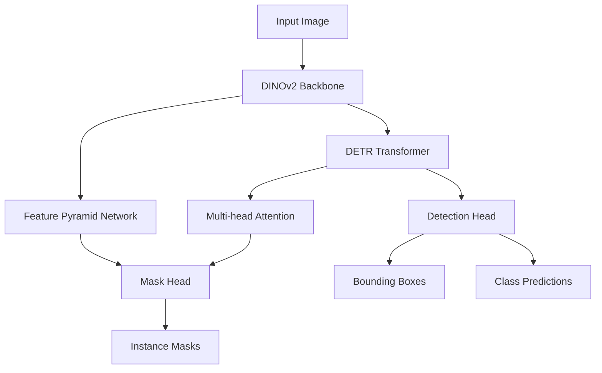

# CLAUDE.md - Improved Version

## Project Overview

RF-DETR-MASK is an instance segmentation extension of the RF-DETR architecture, adding pixel-precise object delineation capabilities to the original object detection model. It extends the base RF-DETR with a mask prediction head for detailed instance segmentation while maintaining real-time performance characteristics.

### Architecture Diagram



### Key Components
- **DINOv2 Backbone**: Extracts multi-scale features from input images
- **DETR Transformer**: Processes feature maps and generates object queries
- **Detection Head**: Produces class predictions and bounding boxes
- **Mask Head**: Creates instance segmentation masks using attention mechanisms
- **Configuration System**: Pydantic-based configuration with YAML files

## Reference Implementations
- [Facebook DETR](https://github.com/facebookresearch/detr), specifically [segmentation.py](https://github.com/facebookresearch/detr/blob/main/models/segmentation.py) for mask head implementation
- [RF-DETR](https://github.com/roboflow/rf-detr) for the core architecture of the object detection model

## Key Files and Directory Structure

```
/configs/           # YAML configuration files
  default.yaml      # Base configuration with mask support
/rfdetr/
  /adapters/        # Configuration, dataset and Lightning adapters
  /models/
    segmentation.py  # Core mask head implementation
    lwdetr.py        # Main detection model implementation
  /util/             # Utility functions and helpers
/scripts/
  train.py          # Main training script
  evaluate.py        # Evaluation script
```

## Mask Head Implementation

The mask prediction is implemented in `rfdetr/models/segmentation.py` through two main classes:

1. `MaskHeadSmallConv`: A convolutional head that predicts masks from transformer output
   - Uses multiple convolutional layers to process feature maps
   - Applies attention mechanism to focus on relevant regions
   - Outputs per-object binary mask predictions

2. `RFDETRSegmentation`: Wrapper that combines the base detector with mask capabilities
   - Manages the flow between the detector and mask head
   - Handles feature extraction and transformation
   - Processes attention maps for mask prediction

## Configuration System

The configuration is fully typed with Pydantic and includes specific mask-related parameters:

```yaml
# Mask Configuration
mask:
  enabled: true        # Enable/disable mask prediction
  loss_mask_coef: 1.0  # Weight for binary mask loss
  loss_dice_coef: 1.0  # Weight for dice coefficient loss
```

## Build/Testing Commands

- Install in dev mode: `uv pip install -e ".[dev]"`
- Run all tests: `python -m unittest discover tests`
- Run segmentation-specific test: `python tests/test_segmentation_integration.py`
- Test mask shape handling: `python tests/test_mask_shape_handling.py`
- Train with default config: `python scripts/train.py`
- Train with mask enabled: `python scripts/train.py configs/mask_enabled.yaml`
- Evaluate a model: `EVAL_ONLY=1 RESUME_CHECKPOINT=path/to/checkpoint python scripts/train.py`
- Run quality checks: `ruff check .` and `mypy .`

## Memory Management

- Run `bash kill.sh` between consecutive runs of training to ensure GPU memory is completely flushed
- When testing the train.py script, use the GPU (as specified in training configs)
- To manually clean GPU memory: `torch.cuda.empty_cache()`

## Training Data Requirements

- Input image sizes must be divisible by 56 (e.g., 560×672)
- Annotation files must be in COCO format with segmentation data
- Use specified test annotation files:
  - `/home/georgepearse/data/cmr/annotations/2025-05-15_12:38:23.077836_train_ordered.json`
  - `/home/georgepearse/data/cmr/annotations/2025-05-15_12:38:38.270134_val_ordered.json`
- Images available at `/home/georgepearse/data/images`

## Code Style Guidelines

- **Imports**: Standard lib first, third-party next (torch, numpy), project imports last
- **Documentation**: Triple double-quotes docstrings explaining purpose/parameters
- **Naming**: snake_case for variables/functions, CamelCase for classes, ALL_CAPS for constants
- **Types**: Use type hints for function signatures and complex data structures
- **Indentation**: 4 spaces
- **File headers**: Include copyright/license information 
- **Design patterns**: Follow PyTorch conventions, use builder pattern for complex objects
- **Inheritance**: Extend appropriate PyTorch classes (nn.Module)
- **Absolute imports**: Always use absolute imports within packages, not relative paths

## Anti-Patterns to Avoid

- **NEVER use `hasattr`**: This is considered an anti-pattern in this repo
  - Replace with Protocol classes and isinstance checks
  - Use proper default values in Pydantic configs
  - Use try/except for runtime attribute checks where appropriate
- **NEVER use `getattr` with defaults**: The underlying class should define default values
- **NEVER use `sys.path.append`**: Fix underlying import structure instead
- **NEVER modify Python's system path**: Fix the imports properly
- **AVOID conditional logic based on config**: Use proper class hierarchy instead

## Performance Optimization

- Always use `torch.no_grad()` for evaluation code
- Use gradient checkpointing for training large models
- Properly handle different model precision modes (fp16/fp32)
- Set appropriate batch sizes based on available GPU memory
- Use PyTorch Lightning's automatic mixed precision where possible
- Utilize EMA (Exponential Moving Average) for better convergence

## Debugging Tips

- Verify image dimensions are divisible by 56
- Check channel ordering (RGB vs BGR) in preprocessing
- Validate mask annotations in COCO format
- Test with rectangular images to ensure proper handling
- Add logging with proper context for each operation
- Use tqdm progress bars for long-running operations

## Implementation Examples

### Mask Loss Implementation

```python
# Calculating mask and dice losses
mask_loss = F.binary_cross_entropy_with_logits(pred_masks, target_masks)
dice_loss = 1 - (2 * intersection + epsilon) / (pred_areas + target_areas + epsilon)

# Combining with detection losses
loss_dict["loss_mask"] = mask_loss * self.mask_loss_coef
loss_dict["loss_dice"] = dice_loss * self.dice_loss_coef
```

### Attention Mechanism for Masks

```python
# Computing attention between queries and features
attention_out, attention_weights = self.bbox_attention(query_embed, src_flat, src_flat)

# Using attention to focus mask prediction
mask_logits = self.mask_head(src, query_embed, attention_weights)
```
